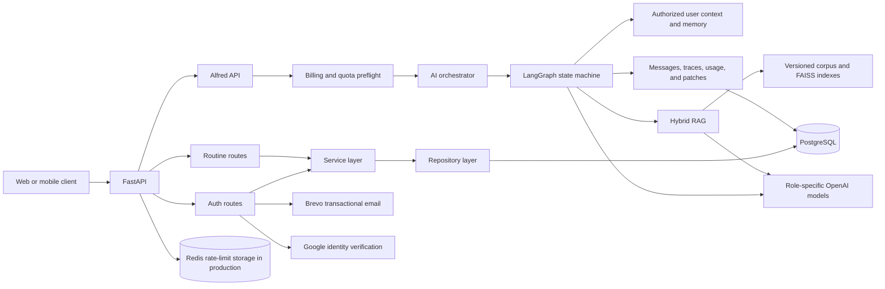

# Winperium Backend

The backend for a routine-management product that combines goals, recurring habits, daily planning, and an AI coach in one API. Its main engineering focus is a safety-aware LangGraph workflow that can reason over user-authorized context, retrieve audited evidence, and propose changes without applying them silently.

## Overview

Winperium helps people plan routines and understand how consistently they execute them. The backend exposes the product domains—accounts, goals, habits, routine items, logs, dashboards, and conversations—through an async FastAPI application backed by PostgreSQL.

The AI experience is exposed as a single assistant named **Alfred**. Requests are routed between deterministic answers, conversational coaching, analytical feedback, and retrieval-augmented responses. When Alfred suggests changing a goal, habit, or routine item, it creates a validated pending patch that still requires an explicit user decision.

## Key Features

- Goal, habit, and routine-item management with recurrence rules, completion logs, vacation periods, agendas, and consistency dashboards.
- Password authentication with email verification, one-time login codes, revocable refresh tokens, password reset, and account deactivation.
- Google sign-in with backend-issued challenges, nonce validation, and verified-email enforcement.
- One versioned Alfred API with synchronous responses, SSE delivery, persisted conversations, usage reporting, and capability discovery.
- LangGraph orchestration with deterministic safety checks, intent routing, behavioral analysis, structured model outputs, criticism, memory, and trace persistence.
- Hybrid RAG over a curated corpus: precomputed FAISS document vectors, runtime query embeddings, BM25, reciprocal-rank fusion, deterministic reranking, and evidence thresholds.
- Human-in-the-loop patch workflow with simulation, validation, idempotency, explicit accept/edit/reject endpoints, and audit records.
- Per-IP throttling plus transactional plan quotas, concurrent-stream reservations, weighted route costs, and a global daily AI cost ceiling.

## Architecture



FastAPI routes remain thin: they validate transport contracts, apply authentication and rate limits, and delegate business rules to services. Services coordinate repositories and domain validation; repositories own SQLAlchemy queries and user-ownership boundaries. Alembic is the source of truth for schema evolution.

The AI path adds a separate preflight boundary. It resolves idempotent replays, verifies billing access, selects a route, reserves quota, and only then invokes the graph. The graph operates on serializable state; database sessions, credentials, and provider clients stay in runtime context rather than agent state.

For a node-level view of the current workflow, see [graph_overview.md](graph_overview.md). The RAG implementation is documented in [Alfred/rag/docs/RAG_ARCHITECTURE.md](Alfred/rag/docs/RAG_ARCHITECTURE.md).

## AI and Retrieval

Alfred is one public assistant backed by four internal capabilities:

- **Deterministic:** answers requests that can be resolved from structured application data without an LLM.
- **Conversational:** plans and generates coaching responses through the Alfred model role.
- **Analytical:** evaluates execution patterns, produces an analysis report, and may propose one bounded change.
- **Knowledge-augmented:** retrieves evidence before continuing through the conversational or analytical path.

The model gateway uses role-specific configurations for routing, Alfred, analytical feedback, and criticism. Every model-backed node requests a strict Pydantic schema. Provider failures degrade to explicit bounded fallbacks instead of inventing structured artifacts.

The production RAG build contains **45 machine-audited documents** across knowledge and playbook namespaces. Canonical content is kept in Markdown/YAML/JSONL; deterministic build manifests bind the chunk artifact and FAISS indexes by hash, model, dimensions, cardinality, and chunk IDs. At runtime, only the user query is embedded with `text-embedding-3-small`.

Retrieval combines normalized dense similarity and an in-memory BM25 index with reciprocal-rank fusion. A deterministic reranker incorporates semantic relevance, lexical coverage, topic alignment, and source traceability. Low-confidence or low-coverage retrieval returns an empty evidence pack rather than forcing unrelated context. Retrieved text is treated as untrusted and passes an indirect prompt-injection filter before model use.

> The corpus is marked `machine_audited`, not `human_reviewed`. Its own metadata and validation rules explicitly require human editorial review before treating it as authoritative health or behavioral guidance.

## Engineering Highlights

- **Defense in depth:** strong configuration validation, Passlib/Bcrypt password handling, hashed action and refresh tokens, HS256 allow-listing, bounded token lifetimes, strict CORS origins, generic account-recovery responses, and production Redis enforcement.
- **Tenant boundaries:** protected queries and patch operations are scoped by the authenticated user; context loaders limit what enters the graph.
- **Transactional AI usage:** usage is reserved before inference and confirmed or released afterward, with idempotency and stale-reservation recovery.
- **Safe mutations:** proposed AI changes are validated against public schemas, simulated against current state, persisted as pending, and applied only after confirmation.
- **Structured resilience:** role-aware timeouts/retries, schema validation, critic review, deterministic fallbacks, terminal SSE error events, and heartbeat frames.
- **Traceable RAG:** integrity-checked build artifacts, source IDs, deterministic chunk IDs, corpus hashes, namespace-specific indexes, and bounded evidence packs.
- **Data lifecycle controls:** configurable retention windows remove expired messages, memories, patches, conversations, and old observability events in a dedicated maintenance job.
- **Deployment safeguards:** Railway runs migrations before deployment; a scheduled GitHub Actions workflow creates encrypted PostgreSQL backups with checksums and short retention.

## Tech Stack

| Area | Technologies |
| --- | --- |
| API | Python 3.13–3.14, FastAPI, Pydantic v2, Uvicorn |
| Persistence | PostgreSQL, SQLAlchemy 2 async, asyncpg, Alembic |
| AI orchestration | LangGraph, LangChain, OpenAI structured outputs |
| Retrieval | FAISS, OpenAI embeddings, NumPy, BM25, reciprocal-rank fusion, tiktoken |
| Security and identity | python-jose, Passlib, Bcrypt, Google Auth, SlowAPI, Redis |
| Integrations | Brevo transactional email, Google Identity, OpenAI |
| Delivery | Docker, Docker Compose, Railway, GitHub Actions |
| Quality | pytest, pytest-asyncio, Ruff, mypy |

## Repository Structure

```text
app/
├── api/              # FastAPI application, routes, dependencies, rate limits
├── ai/               # Alfred graph, prompts, schemas, retrieval, persistence
├── billing/          # Plans, entitlements, provider boundary, usage access
├── core/             # Validated settings and security primitives
├── models/           # SQLAlchemy models
├── repository/       # Auth and routine persistence queries
├── schemas/          # Public auth and routine contracts
└── services/         # Authentication, email, recurrence, routine logic
Alfred/rag/
├── corpus/           # Canonical knowledge, registries, schemas, build artifacts
├── docs/             # Retrieval architecture
└── tests/            # Corpus and retriever tests
alembic/              # Database migration environment and revisions
tests/                # API, database, billing, security, and AI integration tests
scripts/              # Explicit live-model smoke utility
```

## Getting Started

### Prerequisites

- Python 3.13 or 3.14
- [uv](https://docs.astral.sh/uv/)
- PostgreSQL 16+ (or Docker)
- Provider credentials for OpenAI and Brevo when exercising AI or email flows

### Local development

```bash
git clone https://github.com/Vini-create/routine-app-back.git
cd routine-app-back
cp .env.example .env
uv sync --frozen
docker compose up -d db
uv run alembic upgrade head
uv run uvicorn app.api.main:app --reload
```

The API is available at `http://localhost:8000`. FastAPI serves interactive documentation at `http://localhost:8000/docs` and ReDoc at `http://localhost:8000/redoc`.

Generate a development signing key instead of reusing the example value:

```bash
python -c "import secrets; print(secrets.token_urlsafe(64))"
```

Place the result in `SECRET_KEY`, then replace the placeholder provider credentials in `.env`. The default example database URL targets PostgreSQL exposed on the host by Docker Compose.

### Run the full stack with Docker

For the API container, change the database host in `.env` from `localhost` to the Compose service name `db`, then run:

```bash
docker compose up -d db
docker compose run --rm api alembic upgrade head
docker compose up --build api
```

Railway uses the same Dockerfile and runs `alembic upgrade head` through its pre-deploy command.

## Environment Variables

Copy `.env.example`; never commit `.env` or provider credentials.

| Variable | Purpose |
| --- | --- |
| `DATABASE_URL` | PostgreSQL URL; plain `postgres://` and `postgresql://` values are normalized to asyncpg. |
| `SECRET_KEY` | JWT/HMAC signing secret; must contain at least 64 characters. |
| `ALGORITHM` | JWT algorithm; only `HS256` is accepted. |
| `ACCESS_TOKEN_EXPIRE_MINUTES` | Access-token lifetime, constrained to 5–1,440 minutes. |
| `REFRESH_TOKEN_EXPIRE_DAYS` | Refresh-token lifetime, constrained to 1–90 days. |
| `BREVO_API_KEY` | Credential for verification, reset, and login-code emails. |
| `EMAIL_FROM_NAME`, `EMAIL_FROM_ADDRESS` | Transactional email sender identity. |
| `FRONTEND_URL` | Safe absolute base URL used in email links. |
| `CORS_ORIGINS` | Comma-separated HTTP(S) origins; wildcards and paths are rejected. |
| `OPENAI_API_KEY` | Credential for chat models and runtime query embeddings. |
| `RATE_LIMIT_STORAGE_URI` | Shared rate-limit storage; required when `APP_ENV=production`. |
| `LOG_BACKFILL_LIMIT_DAYS` | Maximum past window accepted for completion logs. |
| `ROUTINE_AGENDA_MAX_RANGE_DAYS` | Maximum agenda query interval. |
| `HABITS_DASHBOARD_MAX_RANGE_DAYS` | Maximum habit-dashboard interval. |
| `GOALS_DASHBOARD_MAX_RANGE_DAYS` | Maximum goal-dashboard interval. |
| `FUTURE_SCHEDULE_LIMIT_YEARS` | Maximum future scheduling horizon. |
| `GOOGLE_CLIENT_ID` | Optional Google web client ID; required only for Google sign-in. |

`APP_ENV`, login-challenge limits, model IDs, AI timeouts/retries, retrieval limits, retention windows, and the global AI cost ceiling have validated defaults in `app/core/config.py`. Production deployments should review each explicitly.

`POSTGRES_USER`, `POSTGRES_PASSWORD`, and `POSTGRES_DB` configure the local Compose database; the application itself connects through `DATABASE_URL`.

## API Surface

| Prefix | Responsibility |
| --- | --- |
| `/auth` | Registration, verification, password/Google login, token refresh, password recovery, profile, and logout. |
| `/users` | Authenticated account deletion. |
| `/routine` | Agenda, routine items, completion/vacation logs, habits, goals, and dashboards. |
| `/api/v1/ai` | Alfred invoke/stream, usage, capabilities, patch decisions, and conversation history. |
| `/health` | Deployment health check. |

All routine and Alfred endpoints require a verified active user. Alfred endpoints additionally fail closed unless the user has an active internal billing account. Consult the generated OpenAPI document at `/docs` for request and response schemas.

## Testing and Quality

The automated suite covers API contracts, authentication, recurrence behavior, ownership boundaries, configuration security, billing and quotas, AI graph routing, structured outputs, RAG, streaming, retention, and migrations.

Tests use an isolated `back_routine_test` database and recreate its tables between cases. The PostgreSQL account from `DATABASE_URL` must be able to create that database.

```bash
docker compose up -d db
uv run pytest
uv run ruff check .
```

Validate the canonical RAG corpus independently:

```bash
uv run python Alfred/rag/corpus/scripts/validate_rag.py
```

The script in `scripts/test_alfred_model.py` is an opt-in live-provider smoke test. It consumes OpenAI quota and is intentionally not part of the default test suite.

## Current Status and Limitations

- The repository is the backend only; no frontend source or public deployment URL is included here.
- Paid billing checkout and webhooks are not implemented. The current provider is an internal entitlement boundary, even though paid-plan capability definitions exist.
- The RAG corpus and its 45 indexed documents require human editorial review; there are no published retrieval-quality benchmarks in this repository.
- AI and email features depend on external providers. There is no offline model fallback.
- SSE keeps the connection alive and emits the completed answer in word-sized frames; it does not stream provider tokens while the graph is still executing.
- The current GitHub Actions workflow protects database backups, but the repository does not yet run tests or lint in CI.
- Static typing and repository-wide formatting are not yet clean quality gates; both tools are installed, but the current baseline still needs dedicated cleanup.

## Operations

Run the retention job separately on a daily schedule:

```bash
uv run python -m app.ai.maintenance.retention
```

It removes expired AI content according to the configured retention windows and prints deletion counts only. The included backup workflow creates an encrypted PostgreSQL artifact and checksum; it requires `RAILWAY_DATABASE_PUBLIC_URL` and `BACKUP_ENCRYPTION_PASSWORD` as GitHub Actions secrets.

## Author

**Vinicius França** — [GitHub](https://github.com/Vini-create)
