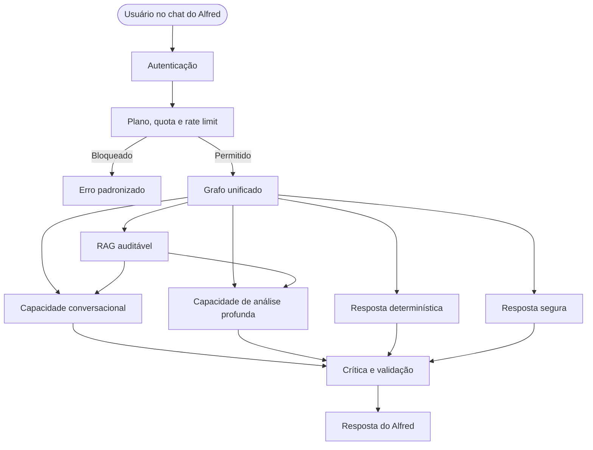

# Winperium — Plano de Implementação do Grafo Unificado de IA

> **Fonte de verdade:** este documento deve permanecer alinhado ao arquivo
> [`graph_overview.md`](graph_overview.md) do projeto.
> **Decisão de produto:** existe uma única experiência pública de IA, apresentada ao usuário como **Alfred**.  
> **Feedbacker não é mais um produto, página, API ou agente público separado.** Ele é a capacidade interna de análise profunda do Alfred e continua com esse nome apenas no código e no grafo para separar responsabilidades técnicas.

---

# 1. Contrato arquitetural

## 1.1 O que o usuário enxerga

O usuário interage com:

- um único chat;
- uma única identidade: Alfred;
- uma única conversa;
- uma única API de IA;
- atalhos de habilidade opcionais no frontend.

Exemplos de habilidades que podem aparecer na interface:

```text
auto
conversar
analisar_progresso
reorganizar_rotina
criar_plano
consultar_conhecimento
```

Essas habilidades são apenas pistas para o roteador. Elas não obrigam o fluxo interno.

Exemplo:

```text
selected_skill = "conversar"
detected_intent = "analisar_rotina"
internal_route = "feedbacker"
```

O Alfred continua sendo a experiência pública, mas utiliza internamente sua capacidade analítica.

## 1.2 O que existe internamente

O Alfred possui quatro capacidades internas de alto nível:

```text
deterministic
conversational
analytical
knowledge_augmented
```

`feedbacker` é o nome técnico da capacidade `analytical`. A capacidade
`knowledge_augmented` utiliza o RAG e sempre devolve o controle para
`conversational` ou `analytical`. Segurança é uma barreira transversal, não um
modo selecionável pelo usuário.

Essas quatro capacidades são materializadas nas seguintes rotas de execução:

O grafo pode escolher entre:

```text
safe_response
deterministic
alfred
feedbacker
rag_then_alfred
rag_then_feedbacker
```

| Rota interna | Responsabilidade |
|---|---|
| `safe_response` | Responder a uma entrada bloqueada ou de risco |
| `deterministic` | Consultar banco, calcular e responder sem LLM |
| `alfred` | Conversa, orientação e intervenção pontual |
| `feedbacker` | Análise profunda, diagnóstico, recomendações e patch |
| `rag_then_alfred` | Buscar conhecimento e depois responder conversacionalmente |
| `rag_then_feedbacker` | Buscar conhecimento e depois realizar análise profunda |

O nome `feedbacker` pode permanecer como identificador técnico interno, mas não deve aparecer como produto separado no contrato público da API.

## 1.3 O que não deve existir

Não criar:

```text
POST /feedbacker
POST /alfred
request_type = "alfred" | "feedbacker"
página pública independente do Feedbacker
billing específico chamado "plano Feedbacker"
```

A API pública é unificada.

---

# 2. Fluxo de alto nível



---

# 3. Relação 1:1 com o grafo oficial

Todos os nodes abaixo devem existir no código, mesmo que alguns comecem com uma implementação determinística simples.

## 3.1 Entrada, idioma e segurança

| Grafo | Função sugerida | Responsabilidade |
|---|---|---|
| `iniciar_estado` | `initialize_state_node` | Criar estado, `request_id`, trace e valores iniciais |
| `detectar_idioma` | `detect_language_node` | Identificar idioma original |
| `normalizar_entrada` | `normalize_input_node` | Limpar e padronizar texto |
| `verificar_injecao` | `check_prompt_injection_node` | Detectar manipulação e prompt injection |
| `classificar_risco` | `classify_safety_risk_node` | Definir risco, categorias e bloqueio |
| `resposta_segura` | `build_safe_response_node` | Criar resposta segura sem seguir para o restante |

Fluxo:

```text
iniciar_estado
→ detectar_idioma
→ normalizar_entrada
→ verificar_injecao
→ classificar_risco
→ entrada permitida?
```

## 3.2 Contexto do usuário

| Grafo | Função sugerida | Responsabilidade |
|---|---|---|
| `carregar_contexto` | `load_user_context_node` | Perfil, metas, hábitos e rotina |
| `carregar_historico` | `load_history_node` | Logs, mensagens e análises anteriores |
| `carregar_memoria` | `load_memory_node` | Recuperar memórias relevantes |
| `construir_contexto` | `build_context_node` | Produzir um contexto estruturado e limitado |

Fluxo:

```text
carregar_contexto
→ carregar_historico
→ carregar_memoria
→ construir_contexto
```

## 3.3 Inteligência comportamental

| Grafo | Função sugerida | Responsabilidade |
|---|---|---|
| `calcular_metricas` | `calculate_metrics_node` | Conclusão, consistência, carga e frequência |
| `detectar_tendencias` | `detect_trends_node` | Melhora, queda e estagnação |
| `detectar_anomalias` | `detect_anomalies_node` | Mudanças incomuns comparadas ao baseline |
| `prever_risco_abandono` | `predict_dropout_risk_node` | Regras ou modelo clássico |
| `construir_estado_comportamental` | `build_behavioral_state_node` | Consolidar métricas e riscos |

Primeira implementação permitida:

- métricas por Python e SQL;
- tendências por comparação de janelas;
- anomalias por regras, z-score robusto ou Isolation Forest;
- risco de abandono por regras transparentes;
- modelo treinado entra somente quando houver dados suficientes.

Nenhum desses cálculos deve ser feito pelo LLM.

## 3.4 Roteamento principal

| Grafo | Função sugerida | Responsabilidade |
|---|---|---|
| `classificar_intencao` | `classify_intent_node` | Entender a intenção e escolher a rota interna |

O node deve combinar:

```text
habilidade selecionada no frontend
+ mensagem
+ contexto
+ complexidade
+ necessidade de conhecimento
+ nível de risco
```

Rotas possíveis:

```python
class InternalRoute(StrEnum):
    SAFE_RESPONSE = "safe_response"
    DETERMINISTIC = "deterministic"
    ALFRED = "alfred"
    FEEDBACKER = "feedbacker"
    RAG_THEN_ALFRED = "rag_then_alfred"
    RAG_THEN_FEEDBACKER = "rag_then_feedbacker"
```

O roteador não deve criar uma experiência pública separada para o Feedbacker.

## 3.5 Resposta determinística

| Grafo | Função sugerida | Responsabilidade |
|---|---|---|
| `responder_dado_simples` | `answer_deterministic_query_node` | Responder diretamente com dados e regras |

Casos iniciais:

- hábitos concluídos hoje;
- taxa de conclusão semanal;
- quantidade de hábitos ativos;
- metas ativas;
- sequência atual;
- comparação simples entre períodos.

Essa rota não utiliza LLM nem RAG.

## 3.6 RAG

| Grafo | Função sugerida | Responsabilidade |
|---|---|---|
| `decidir_busca_rag` | `decide_rag_search_node` | Confirmar necessidade e destino |
| `construir_consulta` | `build_retrieval_query_node` | Gerar consulta estruturada |
| `recuperar_documentos` | `retrieve_documents_node` | Busca vetorial e lexical |
| `reranquear_documentos` | `rerank_documents_node` | Ordenar por relevância e qualidade |
| `validar_recuperacao` | `validate_retrieval_node` | Medir confiança e cobertura |
| `montar_evidence_pack` | `build_evidence_pack_node` | Criar contexto auditável |
| `marcar_baixa_confianca` | `mark_low_retrieval_confidence_node` | Impedir afirmações sem sustentação |

O RAG não responde ao usuário sozinho.

Depois do RAG, o grafo retorna para:

```text
alfred
ou
feedbacker
```

A decisão depende da intenção original.

## 3.7 Capacidade conversacional do Alfred

| Grafo | Função sugerida | Responsabilidade |
|---|---|---|
| `selecionar_estrategia_alfred` | `select_alfred_strategy_node` | Escolher tipo de intervenção |
| `planejar_resposta_alfred` | `plan_alfred_response_node` | Planejar objetivo, tom e ações |
| `gerar_intervencao_alfred` | `generate_alfred_intervention_node` | Criar saída estruturada |
| `renderizar_resposta_alfred` | `render_alfred_response_node` | Transformar estrutura em texto natural |

Essa capacidade é indicada para:

- conversa;
- orientação;
- esclarecimento;
- motivação;
- reflexão;
- intervenção pontual;
- conhecimento aplicado à situação atual.

## 3.8 Capacidade analítica interna, anteriormente chamada Feedbacker

> No código e no grafo, o prefixo `feedbacker` pode continuar sendo usado para manter a separação técnica.  
> No frontend e na API pública, o usuário continua falando com o Alfred.

| Grafo | Função sugerida | Responsabilidade |
|---|---|---|
| `diagnosticar_execucao` | `diagnose_execution_node` | Analisar metas, hábitos, rotina e logs |
| `identificar_padroes` | `identify_patterns_node` | Detectar gargalos e inconsistências |
| `gerar_hipoteses` | `generate_hypotheses_node` | Levantar causas possíveis com confiança |
| `gerar_recomendacoes` | `generate_recommendations_node` | Priorizar intervenções |
| `gerar_patch` | `generate_patch_node` | Propor mudanças estruturadas |
| `definir_metricas_sucesso` | `define_success_metrics_node` | Definir como avaliar a intervenção |
| `montar_relatorio_feedbacker` | `build_analysis_report_node` | Consolidar a análise para o Alfred apresentar |

Saída pública:

```text
Alfred analisou sua rotina e encontrou...
```

Não:

```text
O Feedbacker respondeu...
```

## 3.9 Crítica e validação

| Grafo | Função sugerida | Responsabilidade |
|---|---|---|
| `decidir_uso_critico` | `decide_critic_usage_node` | Ver se uma revisão adicional é necessária |
| `criticar_saida` | `criticize_output_node` | Segurança, grounding e coerência |
| `revisar_saida` | `revise_output_node` | Corrigir apenas problemas detectados |
| `validar_schema` | `validate_output_schema_node` | Validar contrato Pydantic |
| `validar_patch` | `validate_patch_node` | IDs, permissões e regras |
| `simular_patch` | `simulate_patch_node` | Calcular estado proposto |
| `converter_patch_em_texto` | `convert_patch_to_text_node` | Manter recomendação se patch for inválido |
| `preparar_confirmacao` | `prepare_patch_confirmation_node` | Mostrar antes e depois |

O crítico deve ser executado obrigatoriamente quando:

- houver patch;
- o risco for alto;
- o RAG tiver baixa confiança;
- houver hipótese sensível;
- a saída fizer afirmação forte;
- o schema falhar;
- a rota estiver em modo degradado.

Para respostas simples, pode ser ignorado.

## 3.10 Human in the Loop

| Grafo | Função sugerida | Responsabilidade |
|---|---|---|
| `aguardar_confirmacao` | `wait_for_patch_confirmation_node` | Pausar e aguardar decisão |
| `aplicar_patch` | `apply_patch_node` | Aplicar transacionalmente |
| `registrar_rejeicao` | `record_patch_rejection_node` | Salvar rejeição |
| `revalidar_patch_editado` | `revalidate_edited_patch_node` | Revalidar mudanças do usuário |
| `criar_auditoria` | `create_patch_audit_node` | Registrar histórico e rollback |

Implementação HTTP:

1. `/ai/invoke` ou `/ai/stream` gera um patch pendente;
2. o estado é persistido ou checkpointado;
3. o frontend apresenta a comparação;
4. uma rota de `accept`, `reject` ou `edit` continua o fluxo;
5. a IA nunca aplica o patch no mesmo request inicial.

## 3.11 Memória

| Grafo | Função sugerida | Responsabilidade |
|---|---|---|
| `decidir_memoria` | `decide_memory_storage_node` | Avaliar se algo merece persistência |
| `extrair_memoria` | `extract_memory_node` | Extrair fato, preferência ou evento |
| `classificar_memoria` | `classify_memory_node` | Curto prazo, episódica ou semântica |
| `deduplicar_memoria` | `deduplicate_memory_node` | Resolver repetição e conflito |
| `persistir_memoria` | `persist_memory_node` | Salvar com origem, confiança e expiração |

Não salvar:

- toda mensagem;
- informação incerta sem marcação;
- dado sensível desnecessário;
- instrução maliciosa;
- conteúdo que o usuário pediu para não persistir.

## 3.12 Saída e observabilidade

| Grafo | Função sugerida | Responsabilidade |
|---|---|---|
| `formatar_resposta` | `format_final_response_node` | Criar contrato público |
| `traduzir_resposta` | `translate_response_node` | Validar/localizar no idioma original sem outra chamada de LLM |
| `finalizar_trace` | `finalize_trace_node` | Registrar execução, custo e latência |

A resposta pública deve sempre possuir o mesmo formato, independentemente da rota interna.

## 3.13 Aprendizado de intervenções

| Grafo | Função sugerida | Responsabilidade |
|---|---|---|
| `registrar_intervencao` | `record_intervention_job` | Salvar estado anterior e recomendação |
| `observar_resultado` | `observe_intervention_outcome_job` | Esperar janela de avaliação |
| `avaliar_eficacia` | `evaluate_intervention_job` | Comparar métricas |
| banco de eficácia | `intervention_effectiveness` | Histórico de resultados |

Na primeira versão:

- registrar intervenção;
- salvar métricas anteriores;
- definir data de avaliação;
- executar avaliação por tarefa agendada;
- não usar aprendizado automático ainda.

---

# 4. `AgentState` alinhado ao grafo

Criar em:

```text
app/ai/graph/state.py
```

```python
from typing import Any, NotRequired, Required, TypedDict

from app.ai.domain.enums import InternalRoute, SafetyLevel, SelectedSkill


class AgentState(TypedDict):
    """Estado do grafo unificado do Alfred."""

    # Entrada obrigatória
    request_id: Required[str]
    user_id: Required[str]
    conversation_id: Required[str | None]
    selected_skill: Required[SelectedSkill]
    original_input: Required[str]

    # Idioma e normalização
    detected_language: NotRequired[str]
    translation_confidence: NotRequired[float]
    normalized_input: NotRequired[str]

    # Segurança
    prompt_injection_suspected: NotRequired[bool]
    prompt_injection_score: NotRequired[float]
    safety_level: NotRequired[SafetyLevel]
    safety_categories: NotRequired[list[str]]
    safety_risk_score: NotRequired[float]
    security_restrictions: NotRequired[list[str]]
    blocked: NotRequired[bool]
    safe_response: NotRequired[dict[str, Any]]

    # Contexto bruto
    profile: NotRequired[dict[str, Any]]
    goals: NotRequired[list[dict[str, Any]]]
    routines: NotRequired[list[dict[str, Any]]]
    habits: NotRequired[list[dict[str, Any]]]
    habit_logs: NotRequired[list[dict[str, Any]]]
    previous_feedbacks: NotRequired[list[dict[str, Any]]]
    recent_messages: NotRequired[list[dict[str, Any]]]
    conversation_summary: NotRequired[str]
    relevant_memories: NotRequired[list[dict[str, Any]]]

    # Contexto consolidado
    user_context: NotRequired[dict[str, Any]]

    # Inteligência comportamental
    habit_metrics: NotRequired[dict[str, Any]]
    detected_trends: NotRequired[list[dict[str, Any]]]
    detected_anomalies: NotRequired[list[dict[str, Any]]]
    dropout_risk: NotRequired[dict[str, Any]]
    behavioral_state: NotRequired[dict[str, Any]]

    # Intenção e rota
    detected_intent: NotRequired[str]
    intent_confidence: NotRequired[float]
    route: NotRequired[InternalRoute]
    route_confidence: NotRequired[float]
    route_reason: NotRequired[str]
    required_context: NotRequired[list[str]]

    # RAG
    needs_rag: NotRequired[bool]
    rag_destination: NotRequired[str]
    retrieval_topics: NotRequired[list[str]]
    retrieval_query: NotRequired[str]
    retrieved_documents: NotRequired[list[dict[str, Any]]]
    retrieval_confidence: NotRequired[float]
    retrieval_coverage: NotRequired[float]
    insufficient_evidence: NotRequired[bool]
    evidence_pack: NotRequired[dict[str, Any]]

    # Capacidade conversacional
    alfred_strategy: NotRequired[str]
    alfred_plan: NotRequired[dict[str, Any]]
    alfred_intervention: NotRequired[dict[str, Any]]
    rendered_response: NotRequired[str]

    # Capacidade analítica interna
    execution_diagnosis: NotRequired[dict[str, Any]]
    identified_patterns: NotRequired[list[dict[str, Any]]]
    root_cause_hypotheses: NotRequired[list[dict[str, Any]]]
    recommendations: NotRequired[list[dict[str, Any]]]
    analysis_report: NotRequired[dict[str, Any]]

    # Patch e avaliação da intervenção
    proposed_patch: NotRequired[dict[str, Any] | None]
    success_metrics: NotRequired[list[dict[str, Any]]]
    patch_validation: NotRequired[dict[str, Any]]
    patch_simulation: NotRequired[dict[str, Any]]
    patch_requires_confirmation: NotRequired[bool]
    patch_id: NotRequired[str | None]

    # Crítica
    critic_required: NotRequired[bool]
    critic_output: NotRequired[dict[str, Any]]
    revision_count: NotRequired[int]
    schema_valid: NotRequired[bool]
    validation_errors: NotRequired[list[str]]

    # Memória
    memory_candidates: NotRequired[list[dict[str, Any]]]
    memories_to_store: NotRequired[list[dict[str, Any]]]
    summary_update: NotRequired[str | None]

    # Resposta
    final_response: NotRequired[dict[str, Any]]

    # Resiliência e observabilidade
    degraded_mode: NotRequired[bool]
    unavailable_components: NotRequired[list[str]]
    fallback_used: NotRequired[str | None]
    errors: NotRequired[list[dict[str, Any]]]
    trace_data: NotRequired[dict[str, Any]]
    token_usage: NotRequired[dict[str, Any]]
    latency_metrics: NotRequired[dict[str, float]]
```

## 4.1 O que não entra no `AgentState`

Não colocar no estado:

- senha;
- JWT;
- objetos de sessão de banco;
- cliente do modelo;
- cliente Stripe;
- segredo;
- conexão Redis;
- configuração completa do plano.

Esses objetos entram por dependência, runtime context ou service layer.

---

# 5. Estrutura de pastas

```text
app/
├── ai/
│   ├── domain/
│   │   ├── enums.py
│   │   └── errors.py
│   ├── schemas/
│   │   ├── requests.py
│   │   ├── responses.py
│   │   ├── routing.py
│   │   ├── alfred.py
│   │   ├── analysis.py
│   │   ├── patches.py
│   │   ├── safety.py
│   │   └── retrieval.py
│   ├── graph/
│   │   ├── state.py
│   │   ├── builder.py
│   │   ├── conditions.py
│   │   └── nodes/
│   │       ├── entry.py
│   │       ├── context.py
│   │       ├── behavioral.py
│   │       ├── routing.py
│   │       ├── deterministic.py
│   │       ├── retrieval.py
│   │       ├── conversation.py
│   │       ├── analysis.py
│   │       ├── validation.py
│   │       ├── human_loop.py
│   │       ├── memory.py
│   │       └── output.py
│   ├── services/
│   │   ├── ai_orchestrator.py
│   │   ├── usage_service.py
│   │   ├── patch_service.py
│   │   ├── conversation_service.py
│   │   └── intervention_service.py
│   ├── repositories/
│   └── prompts/
├── billing/
│   ├── models.py
│   ├── repository.py
│   ├── service.py
│   ├── entitlements.py
│   └── provider.py
└── api/
    └── v1/
        ├── ai_routes.py
        └── billing_routes.py
```

O arquivo `analysis.py` substitui conceitualmente um serviço público chamado `feedbacker.py`.

---

# 6. Schemas públicos da API

## 6.1 Habilidade selecionada no frontend

```python
class SelectedSkill(StrEnum):
    AUTO = "auto"
    CONVERSAR = "conversar"
    ANALISAR_PROGRESSO = "analisar_progresso"
    REORGANIZAR_ROTINA = "reorganizar_rotina"
    CRIAR_PLANO = "criar_plano"
    CONSULTAR_CONHECIMENTO = "consultar_conhecimento"
```

## 6.2 Request unificado

```python
class AIInvokeRequest(BaseModel):
    conversation_id: str | None = None
    message: str = Field(min_length=1, max_length=4000)
    selected_skill: SelectedSkill = SelectedSkill.AUTO
    screen_context: dict[str, Any] | None = None
    idempotency_key: str | None = None
```

## 6.3 Response unificado

```python
class AIInvokeResponse(BaseModel):
    request_id: str
    conversation_id: str
    route: InternalRoute
    message: str
    references: list[dict[str, Any]] = []
    analysis: dict[str, Any] | None = None
    proposed_patch: dict[str, Any] | None = None
    requires_confirmation: bool = False
    usage: dict[str, Any]
```

O campo `route` pode ser mantido para observabilidade e portfólio. O frontend não deve usá-lo para criar experiências separadas.

---

# 7. Banco de dados

## 7.1 Tabelas de IA

### `ai_conversations`

```text
id
user_id
title
summary_en
created_at
updated_at
deleted_at
```

### `ai_messages`

```text
id
conversation_id
user_id
role
content
detected_language
route
request_id
created_at
```

### `ai_usage_events`

```text
id
request_id
user_id
conversation_id
route
plan_code
reserved_units
consumed_units
input_tokens
output_tokens
estimated_cost
latency_ms
status
created_at
```

### `ai_proposed_patches`

```text
id
request_id
user_id
conversation_id
status
entity_type
entity_id
operations
reason
simulation
success_metrics
expires_at
applied_at
rejected_at
created_at
```

### `ai_patch_audit`

```text
id
patch_id
user_id
action
before_state
after_state
rollback_payload
created_at
```

### `ai_memories`

```text
id
user_id
conversation_id
memory_type
content
confidence
importance
source_request_id
expires_at
created_at
updated_at
```

### `ai_interventions`

```text
id
user_id
request_id
intervention_type
before_metrics
expected_metrics
evaluation_due_at
after_metrics
outcome
created_at
evaluated_at
```

---

# 8. Planos e arquitetura pronta para Stripe

## 8.1 Fonte de verdade interna

Criar:

```text
billing_accounts
```

Campos:

```text
id
user_id
plan_code
subscription_status
billing_provider
provider_customer_id
provider_subscription_id
current_period_start
current_period_end
cancel_at_period_end
created_at
updated_at
```

Todo usuário atual e novo começa com:

```text
plan_code = "free"
subscription_status = "active"
billing_provider = "internal"
provider_customer_id = null
provider_subscription_id = null
```

Não criar cliente Stripe para usuários gratuitos agora.

## 8.2 Entitlements

```python
PLAN_ENTITLEMENTS = {
    "free": {
        "requests_per_minute": 6,
        "ai_units_per_day": None,
        "standard_requests_per_day": 30,
        "rag_requests_per_day": 15,
        "deep_analyses_per_week": 3,
        "max_concurrent_streams": 1,
        "rag_enabled": True,
        "patch_generation_enabled": True,
        "memory_level": "basic",
        "max_input_chars": 4000,
    },
    "pro": {
        "requests_per_minute": 20,
        "ai_units_per_day": 200,
        "standard_requests_per_day": None,
        "rag_requests_per_day": None,
        "deep_analyses_per_week": None,
        "max_concurrent_streams": 2,
        "rag_enabled": True,
        "patch_generation_enabled": True,
        "memory_level": "advanced",
        "max_input_chars": 8000,
    },
    "plus": {
        "requests_per_minute": 40,
        "ai_units_per_day": 500,
        "standard_requests_per_day": None,
        "rag_requests_per_day": None,
        "deep_analyses_per_week": None,
        "max_concurrent_streams": 3,
        "rag_enabled": True,
        "patch_generation_enabled": True,
        "memory_level": "advanced",
        "max_input_chars": 12000,
    },
    "max": {
        "requests_per_minute": 80,
        "ai_units_per_day": 2000,
        "standard_requests_per_day": None,
        "rag_requests_per_day": None,
        "deep_analyses_per_week": None,
        "max_concurrent_streams": 5,
        "rag_enabled": True,
        "patch_generation_enabled": True,
        "memory_level": "advanced",
        "max_input_chars": 16000,
    },
}
```

Inicialmente, somente o plano `free` precisa estar disponível comercialmente. Os demais ficam preparados.

## 8.3 Custo por rota interna

Não criar um limite público separado chamado “Feedbacker”.

```python
ROUTE_UNIT_COST = {
    "safe_response": 0,
    "deterministic": 0,
    "alfred": 1,
    "rag_then_alfred": 2,
    "feedbacker": 3,
    "rag_then_feedbacker": 4,
}
```

Assim, o usuário possui uma quota única do Alfred. Análises profundas apenas consomem mais unidades por exigirem mais processamento.

## 8.4 Stripe futuro

```python
class BillingProvider(Protocol):
    async def create_customer(self, user: User) -> str:
        ...

    async def create_checkout_session(
        self,
        *,
        user: User,
        plan_code: str,
    ) -> str:
        ...

    async def create_customer_portal(self, customer_id: str) -> str:
        ...
```

Implementações:

```text
InternalBillingProvider
StripeBillingProvider
```

O grafo de IA não conhece Stripe.

Fluxo futuro:

```text
checkout
→ pagamento
→ webhook assinado
→ idempotência
→ atualização do billing_account
→ novos entitlements
```

Nunca alterar o plano pago com base apenas no retorno do frontend.

---

# 9. Rate limit e proteção de custo

## 9.1 Ordem antes de entrar no grafo

```text
request_id
→ autenticação JWT
→ propriedade da conversa
→ billing account
→ entitlements
→ limite por minuto
→ streams concorrentes
→ quotas diária e semanal por categoria
→ reserva de unidades
→ execução do grafo
```

## 9.2 Duas camadas

### Rajada

```text
6 requisições por minuto para o plano free
```

### Quotas do plano free

```text
30 inputs determinísticos ou conversacionais por dia
15 inputs que usam RAG por dia
3 análises profundas por semana
```

Uma execução `rag_then_feedbacker` conta tanto na quota diária de RAG quanto na
quota semanal de análise profunda. Respostas de segurança não consomem essas
quotas, para que o sistema continue capaz de responder de forma segura.

As unidades ponderadas continuam sendo reservadas depois da classificação
preliminar e confirmadas ao final. No free elas servem para auditoria de custo;
nos planos pagos preparados elas continuam sendo a quota diária.

Se a execução falhar antes de chamar modelo ou RAG, a reserva pode ser liberada.

## 9.3 Proteção global

Adicionar:

- teto global diário de custo;
- máximo de tokens de saída;
- timeout por chamada;
- timeout total;
- circuit breaker;
- limite de retries;
- cache do RAG;
- resposta determinística sempre que possível.

---

# 10. API unificada para o frontend

Prefixo:

```text
/api/v1
```

## 10.1 Invocação completa

```text
POST /api/v1/ai/invoke
```

Request:

```json
{
  "conversation_id": null,
  "message": "Analise por que perdi consistência nas últimas semanas.",
  "selected_skill": "analisar_progresso",
  "screen_context": {
    "page": "habits"
  },
  "idempotency_key": "uuid-opcional"
}
```

O frontend não envia:

```text
request_type = "feedbacker"
```

## 10.2 Streaming

```text
POST /api/v1/ai/stream
```

Eventos SSE:

```text
status
token
reference
analysis
patch
warning
done
error
```

Exemplos:

```text
event: status
data: {"node":"calcular_metricas","message":"Analisando sua execução"}

event: status
data: {"node":"identificar_padroes","message":"Identificando padrões"}

event: token
data: {"content":"Encontrei uma queda de consistência..."}

event: patch
data: {"patch_id":"patch_123","requires_confirmation":true}

event: done
data: {"request_id":"req_123","route":"feedbacker"}
```

Embora a rota interna seja `feedbacker`, a interface continua exibindo o Alfred.

## 10.3 Uso e capacidades

```text
GET /api/v1/ai/usage
GET /api/v1/ai/capabilities
```

Resposta de uso:

```json
{
  "plan": "free",
  "weighted_units_today": {
    "used": 8,
    "limit": null,
    "remaining": null,
    "reset_at": "2026-07-27T03:00:00Z"
  },
  "standard_requests_today": {
    "used": 12,
    "limit": 30,
    "remaining": 18,
    "reset_at": "2026-07-27T03:00:00Z"
  },
  "rag_requests_today": {
    "used": 4,
    "limit": 15,
    "remaining": 11,
    "reset_at": "2026-07-27T03:00:00Z"
  },
  "deep_analyses_this_week": {
    "used": 1,
    "limit": 3,
    "remaining": 2,
    "reset_at": "2026-07-27T03:00:00Z"
  },
  "requests_per_minute": 6
}
```

Resposta de capacidades:

```json
{
  "plan": "free",
  "capabilities": {
    "conversation": true,
    "deep_analysis": true,
    "rag": true,
    "patch_generation": true,
    "memory": "basic",
    "streaming": true
  }
}
```

## 10.4 Patches

```text
POST /api/v1/ai/patches/{patch_id}/accept
POST /api/v1/ai/patches/{patch_id}/reject
POST /api/v1/ai/patches/{patch_id}/edit
```

Aceitar:

1. autenticar;
2. verificar propriedade;
3. verificar status pendente;
4. verificar expiração;
5. validar novamente;
6. aplicar em transação;
7. criar auditoria;
8. registrar intervenção;
9. devolver estado atualizado.

## 10.5 Conversas

```text
POST   /api/v1/ai/conversations
GET    /api/v1/ai/conversations
GET    /api/v1/ai/conversations/{conversation_id}
DELETE /api/v1/ai/conversations/{conversation_id}
```

Não criar conversas separadas para Alfred e Feedbacker.

---

# 11. Construção do LangGraph

## 11.1 Regra dos nodes

Cada node deve:

- receber o estado;
- executar uma responsabilidade;
- retornar somente os campos alterados;
- ter timeout quando chamar serviço externo;
- registrar latência;
- acumular erro estruturado;
- ser testável isoladamente.

Formato conceitual:

```python
async def calculate_metrics_node(
    state: AgentState,
) -> dict[str, Any]:
    metrics = ...
    return {"habit_metrics": metrics}
```

## 11.2 Conditional edges

Condições necessárias:

```text
entrada permitida?
qual fluxo executar?
conhecimento suficiente?
destino após o RAG?
executar crítico?
saída aprovada?
existe patch?
patch seguro?
decisão do usuário?
salvar memória?
```

Centralizar essas funções em:

```text
app/ai/graph/conditions.py
```

Evitar lógica condicional espalhada pelos nodes.

## 11.3 Checkpoint

Para o Human in the Loop:

- persistir checkpoint por `conversation_id` e `request_id`;
- retornar patch pendente;
- continuar após `accept`, `reject` ou `edit`;
- impedir retomada por outro usuário;
- expirar checkpoints antigos.

---

# 12. Ordem exata de implementação

## Progresso no projeto

Para reduzir risco de custo antes da exposição da API, a execução prática foi
reorganizada em etapas maiores:

```text
Etapa 1 concluída → contratos canônicos (Fase 1)
Etapa 2 concluída → billing e proteção de custo (Fase 11 antecipada)
Etapa 3 concluída → esqueleto completo + baseline de entrada/segurança
                     (Fases 2 e 3)
Etapa 4 concluída → segurança de entrada reforçada + contexto real +
                     inteligência comportamental determinística
                     (Fases 4 e 5)
Etapa 5 concluída → localização offline + roteamento híbrido +
                     gateway LangChain por papel + primeiras capacidades
                     reais de Alfred e análise (Fase 6 + parte da Fase 7)
Etapa 6 concluída → RAG multilíngue local, híbrido e auditável
                     (restante da Fase 7)
Etapa 7 concluída → crítico, persistência, memória, HITL, API unificada,
                     checkpoints, streaming e observabilidade
                     (Fases 8, 9, 10 e 12)
```

Todos os nodes do request graph existem e todos os caminhos compilam com
LangGraph. Na Etapa 4, contexto e comportamento deixaram de ser placeholders:
o grafo faz leituras limitadas e isoladas por usuário no PostgreSQL e calcula
métricas, tendências, anomalias e risco por regras transparentes sem LLM.
O fluxo final mantém o estado serializável, injeta dependências por
`GraphRuntimeContext` e persiste conversas, mensagens, memórias, propostas,
auditorias, intervenções e checkpoints no PostgreSQL. Nenhum patch é aplicado
no request que o criou.

## Fase 1 — Contratos

1. criar `SelectedSkill`;
2. criar `InternalRoute`;
3. criar `SafetyLevel`;
4. substituir `request_type`;
5. criar `AgentState`;
6. criar schemas Pydantic;
7. criar testes dos contratos.

## Fase 2 — Esqueleto completo do grafo

8. criar todos os nodes como stubs;
9. criar todas as decisões condicionais;
10. conectar edges;
11. compilar o grafo;
12. testar cada caminho usando respostas fixas.

## Fase 3 — Entrada e segurança

13. `iniciar_estado`;
14. `detectar_idioma`;
15. `normalizar_entrada`;
16. `verificar_injecao`;
17. `classificar_risco`;
18. `resposta_segura`.

## Fase 4 — Contexto

19. `carregar_contexto`;
20. `carregar_historico`;
21. `carregar_memoria`;
22. `construir_contexto`.

## Fase 5 — Inteligência comportamental

23. `calcular_metricas`;
24. `detectar_tendencias`;
25. `detectar_anomalias`;
26. `prever_risco_abandono`;
27. `construir_estado_comportamental`.

## Fase 6 — Roteamento

28. `classificar_intencao`;
29. rota determinística;
30. rota conversacional;
31. rota analítica;
32. rota RAG com destino.

## Fase 7 — Capacidades

33. `responder_dado_simples`;
34. pipeline RAG;
35. quatro nodes conversacionais;
36. sete nodes analíticos.

## Fase 8 — Validação

37. crítico;
38. revisão;
39. schema;
40. validação do patch;
41. simulação;
42. confirmação.

## Fase 9 — Persistência e memória

43. conversas;
44. mensagens;
45. patches;
46. auditoria;
47. memórias;
48. intervenções.

## Fase 10 — API

49. `AIOrchestrator`;
50. `/ai/invoke`;
51. `/ai/stream`;
52. rotas de patch;
53. rotas de conversas;
54. `/ai/usage`;
55. `/ai/capabilities`.

## Fase 11 — Planos e segurança de custo

56. `billing_accounts`;
57. backfill de todos os usuários para `free`;
58. `EntitlementService`;
59. `ai_usage_events`;
60. rate limit;
61. quota ponderada;
62. limite de stream;
63. teto global de custo.

## Fase 12 — Aprendizado e observabilidade

64. trace;
65. tokens;
66. custo;
67. latência;
68. registrar intervenção;
69. tarefa de observação;
70. avaliação de eficácia.

---

# 13. Testes obrigatórios

## 13.1 Roteamento

```text
"Quantos hábitos concluí hoje?"
→ deterministic

"Estou perdendo a motivação."
→ alfred

"Analise meus últimos 30 dias."
→ feedbacker

"O que a ciência diz sobre procrastinação?"
→ rag_then_alfred

"Analise minha rotina considerando evidências sobre sono."
→ rag_then_feedbacker
```

## 13.2 Unidade pública

Todos devem usar:

```text
POST /api/v1/ai/invoke
```

Nenhum teste deve depender de uma rota pública `/feedbacker`.

## 13.3 Segurança

- prompt injection;
- vazamento de prompt;
- alteração de `user_id`;
- conversa de outro usuário;
- patch em entidade de outro usuário;
- payload excessivo;
- resposta clínica indevida;
- baixa confiança do RAG.

## 13.4 Billing e rate limit

- usuário antigo recebe `free`;
- novo usuário recebe `free`;
- determinístico não consome unidade;
- Alfred consome uma unidade;
- análise profunda consome três;
- RAG mais análise consome quatro;
- limite por minuto retorna `429`;
- 31º input padrão no mesmo dia retorna `429`;
- 16º input com RAG no mesmo dia retorna `429`;
- 4ª análise profunda na mesma semana retorna `429`;
- análise profunda com RAG conta nas duas categorias;
- reserva duplicada é idempotente;
- stream desconectado libera slot.

## 13.5 Human in the Loop

- aceitar;
- rejeitar;
- editar;
- revalidar;
- expirar;
- tentar aplicar duas vezes;
- tentar aplicar patch de outro usuário;
- gerar auditoria.

---

# 14. Definition of Done

- [x] existe uma única experiência pública chamada Alfred;
- [x] Feedbacker é somente uma capacidade interna;
- [x] não existe rota pública separada do Feedbacker;
- [x] não existe `request_type: "alfred" | "feedbacker"`;
- [x] o frontend envia `selected_skill`;
- [x] o grafo decide `InternalRoute`;
- [x] todos os nodes do Mermaid existem no código;
- [x] os caminhos do Mermaid compilam;
- [x] perguntas simples não usam LLM;
- [x] RAG retorna ao fluxo conversacional ou analítico;
- [x] métricas são calculadas fora do LLM;
- [x] análise profunda pode gerar patch;
- [x] patch nunca é aplicado no request inicial;
- [x] confirmação humana funciona;
- [x] memória possui origem, confiança e expiração;
- [x] todos os usuários estão no plano `free`;
- [x] rate limit depende do plano interno;
- [x] eventos mantêm unidades ponderadas e o free usa quotas por categoria;
- [x] o grafo não depende do Stripe;
- [x] a arquitetura aceita Stripe por provider e webhook;
- [x] `/ai/invoke` funciona;
- [x] `/ai/stream` funciona;
- [x] `/ai/usage` funciona;
- [x] `/ai/capabilities` funciona;
- [x] erros possuem `request_id`;
- [x] tokens e latência são registrados; custo monetário fica no dashboard do provider;
- [x] testes de rota, segurança e patch passam.

---

# 15. Regra final de nomenclatura

## Público

Usar:

```text
Alfred
Analisar progresso
Reorganizar rotina
Criar plano
Consultar conhecimento
```

## Interno

Pode usar:

```text
alfred
feedbacker
rag_then_alfred
rag_then_feedbacker
```

## Explicação para portfólio

> O Winperium oferece uma única experiência conversacional chamada Alfred. Internamente, um grafo de agentes classifica a intenção e roteia cada requisição entre respostas determinísticas, conversa orientativa, análise comportamental profunda e recuperação auditável de conhecimento. A antiga função Feedbacker foi incorporada como uma capacidade analítica do Alfred, responsável por diagnóstico, recomendações estruturadas, geração segura de patches e acompanhamento da eficácia das intervenções.
