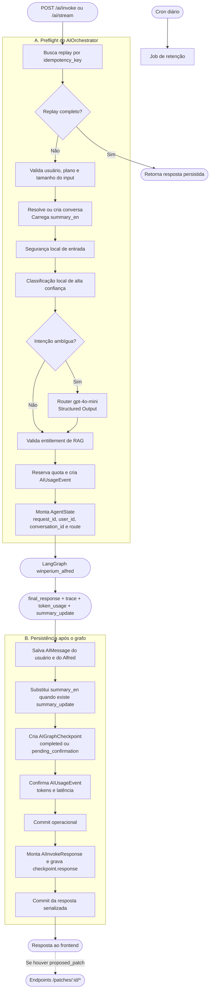
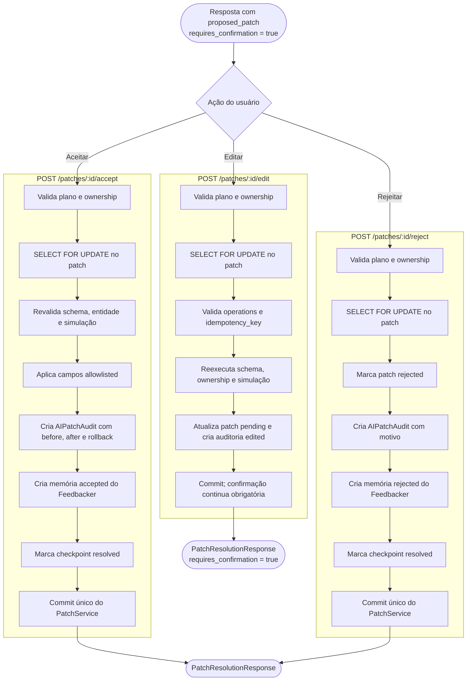
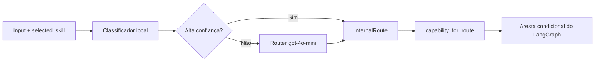
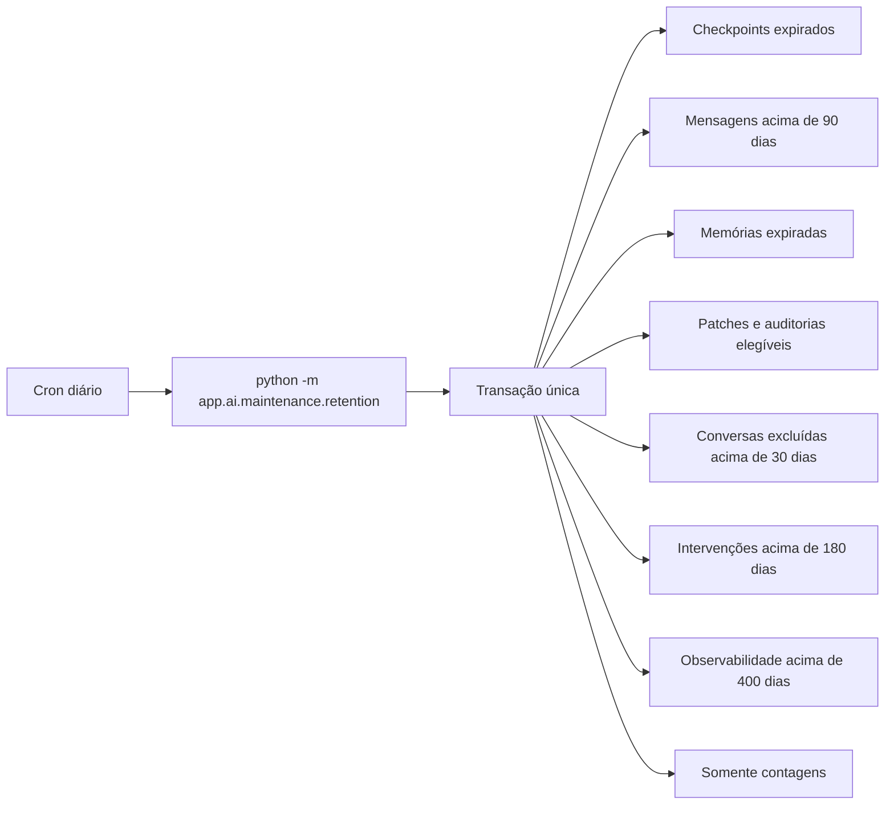
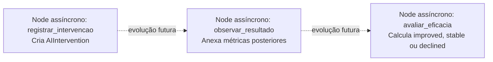

# Winperium — Grafo Unificado de IA

Este documento representa o runtime atual do Alfred. Ele separa quatro
fronteiras que possuem responsabilidades diferentes:

1. preflight do orquestrador;
2. grafo LangGraph compilado;
3. persistência e Human in the Loop da aplicação;
4. manutenção assíncrona de retenção.

Fontes de implementação:

- `app/ai/services/orchestrator.py`;
- `app/ai/graph/builder.py`;
- `app/ai/graph/nodes/`;
- `app/ai/services/patch_service.py`;
- `app/ai/maintenance/retention.py`.

---

## 1. Runtime completo



### Por que a rota é resolvida antes do LangGraph?

A rota determina a quota, o entitlement de RAG e o custo lógico da chamada.
Por isso o orquestrador precisa classificá-la antes de reservar uso. O node
`classificar_intencao` continua dentro do grafo: em produção ele confirma e
materializa a decisão confiável no `AgentState`; em invocações diretas sem rota,
ele próprio executa regras locais e, se houver gateway, o router.

### Limite transacional atual

`confirm_ai_usage()` executa commit. Assim, mensagens, resumo, checkpoint e uso
são persistidos no primeiro commit; `checkpoint.response` é preenchido em um
segundo commit. O diagrama mostra essa fronteira real.

---

## 2. LangGraph compilado

O grafo principal possui 56 nodes. `START` e `END` são elementos do LangGraph,
não nodes de negócio.

```mermaid
flowchart TD
    START([START])

    %% =========================================================
    %% 1. ENTRADA, IDIOMA E SEGURANÇA
    %% =========================================================

    subgraph ENTRADA["1. Entrada, idioma e segurança"]
        N1[Node: iniciar_estado<br/>Inicializa trace, erros e fallback;<br/>preserva IDs criados pelo orquestrador]
        N2[Node: detectar_idioma<br/>Detecção offline do idioma]
        N3[Node: normalizar_entrada<br/>Normaliza Unicode, espaços e conteúdo]
        N4[Node: verificar_injecao<br/>Regras multilíngues e conteúdo ofuscado]
        N5[Node: classificar_risco<br/>Segurança pessoal e restrições]
        D1{blocked?}
        N6[Node: resposta_segura<br/>Resposta localizada sem contexto privado]
    end

    START --> N1
    N1 --> N2
    N2 --> N3
    N3 --> N4
    N4 --> N5
    N5 --> D1
    D1 -->|Sim| N6
    D1 -->|Não| N7

    %% =========================================================
    %% 2. CONTEXTO
    %% =========================================================

    subgraph CONTEXTO["2. Contexto autenticado e limitado"]
        N7[Node: carregar_contexto<br/>Perfil, coach, metas, hábitos e rotina ativos]
        N8[Node: carregar_historico<br/>Logs da janela, feedbacks e AIMessage<br/>da conversa atual]
        N9[Node: carregar_memoria<br/>Memórias válidas e, só no Feedbacker,<br/>4 decisões mais recentes]
        N10[Node: construir_contexto<br/>Aplica limites, idioma e trust boundaries]
    end

    N7 --> N8
    N8 --> N9
    N9 --> N10

    %% =========================================================
    %% 3. INTELIGÊNCIA COMPORTAMENTAL
    %% =========================================================

    subgraph COMPORTAMENTO["3. Inteligência comportamental determinística"]
        N11[Node: calcular_metricas<br/>Conclusão, consistência, carga e streak]
        N12[Node: detectar_tendencias<br/>Melhora, queda ou estabilidade]
        N13[Node: detectar_anomalias<br/>Regras transparentes]
        N14[Node: prever_risco_abandono<br/>Score explicável, não clínico]
        N15[Node: construir_estado_comportamental<br/>Consolida métricas e riscos]
    end

    N10 --> N11
    N11 --> N12
    N12 --> N13
    N13 --> N14
    N14 --> N15

    %% =========================================================
    %% 4. ROTEAMENTO
    %% =========================================================

    subgraph ROTEAMENTO["4. Roteamento e capacidade"]
        N16[Node: classificar_intencao<br/>Registra route, capability,<br/>confiança, motivo e contexto exigido;<br/>pede objetivo antes da rotina ideal]
        D2{route}
    end

    N15 --> N16
    N16 --> D2

    D2 -->|safe_response| N6
    D2 -->|deterministic| S1
    D2 -->|alfred| A1
    D2 -->|feedbacker| F1
    D2 -->|rag_then_alfred| R1
    D2 -->|rag_then_feedbacker| R1

    %% =========================================================
    %% 5. RESPOSTA DETERMINÍSTICA
    %% =========================================================

    subgraph SIMPLES["5. Capacidade deterministic"]
        S1[Node: responder_dado_simples<br/>Responde com dados estruturados e regras;<br/>não chama LLM]
    end

    S1 --> V4

    %% =========================================================
    %% 6. RAG
    %% =========================================================

    subgraph RAG["6. Capacidade knowledge_augmented"]
        R1[Node: decidir_busca_rag<br/>Marca necessidade e destino]
        R2[Node: construir_consulta<br/>Gera consulta limitada]
        R3[Node: recuperar_documentos<br/>Recuperação lexical + vetorial local]
        R4[Node: reranquear_documentos<br/>Score híbrido e limite de candidatos]
        R5[Node: validar_recuperacao<br/>Cobertura e confiança]
        D3{Evidência suficiente?}
        R6[Node: montar_evidence_pack<br/>Trechos, referências e grounding]
        R7[Node: marcar_baixa_confianca<br/>Explicita insuficiência de evidência]
        D4{rag_destination}
    end

    R1 --> R2
    R2 --> R3
    R3 --> R4
    R4 --> R5
    R5 --> D3
    D3 -->|Sim| R6
    D3 -->|Não| R7
    R6 --> D4
    R7 --> D4
    D4 -->|alfred| A1
    D4 -->|feedbacker| F1

    %% =========================================================
    %% 7. ALFRED CONVERSACIONAL
    %% =========================================================

    subgraph ALFRED["7. Capacidade conversational"]
        A1[Node: selecionar_estrategia_alfred<br/>Escolhe explicação, conversa,<br/>recuperação ou esclarecimento de objetivo<br/>+ recupera frase editorial motivacional opcional]
        A2[Node: planejar_resposta_alfred<br/>Objetivo, tom, pontos e próximos passos]
        A3[Node: gerar_intervencao_alfred<br/>gpt-4o-mini; resposta estruturada<br/>+ revisão antirrepetição opcional<br/>+ updated_summary_en]
        A4[Node: renderizar_resposta_alfred<br/>Monta mensagem e candidatos de memória]
    end

    A1 --> A2
    A2 --> A3
    A3 --> A4
    A4 --> V1

    %% =========================================================
    %% 8. FEEDBACKER
    %% =========================================================

    subgraph FEEDBACKER["8. Capacidade analytical"]
        F1[Node: diagnosticar_execucao<br/>Diagnóstico determinístico da janela]
        F2[Node: identificar_padroes<br/>Converte tendências e anomalias em evidências]
        F3[Node: gerar_hipoteses<br/>gpt-5; hipóteses, recomendações,<br/>patch e updated_summary_en]
        F4[Node: gerar_recomendacoes<br/>Extrai recomendações estruturadas]
        F5[Node: gerar_patch<br/>Extrai no máximo um ProposedPatch<br/>ou cria fallback seguro para sugestão aberta]
        F6[Node: definir_metricas_sucesso<br/>Extrai métricas mensuráveis]
        F7[Node: montar_relatorio_feedbacker<br/>Monta AnalysisReport e resposta Alfred]
    end

    F1 --> F2
    F2 --> F3
    F3 --> F4
    F4 --> F5
    F5 --> F6
    F6 --> F7
    F7 --> V1

    %% =========================================================
    %% 9. CRÍTICA, SCHEMA E PATCH
    %% =========================================================

    subgraph VALIDACAO["9. Crítica, schema e patch"]
        V1[Node: decidir_uso_critico<br/>Ativa crítico para Feedbacker ou patch]
        D5{critic_required?}
        V2[Node: criticar_saida<br/>gpt-4o-mini; segurança,<br/>grounding e coerência]
        D6{approved?}
        V3[Node: revisar_saida<br/>Aplica revisão limitada uma vez]
        V4[Node: validar_schema<br/>Valida AnalysisReport, ProposedPatch<br/>e tamanho da mensagem]
        D7{proposed_patch existe?}
        V5[Node: validar_patch<br/>Schema, ownership, allowlist e regras;<br/>também executa a simulação real]
        V6[Node: simular_patch<br/>Propaga a simulação produzida por validar_patch]
        D8{valid e safe?}
        V7[Node: converter_patch_em_texto<br/>Remove patch inseguro e mantém orientação]
        V8[Node: preparar_confirmacao<br/>Revalida, persiste patch pending<br/>e anexa simulation + patch_id]
    end

    V1 --> D5
    D5 -->|Não| V4
    D5 -->|Sim| V2
    V2 --> D6
    D6 -->|Sim| V4
    D6 -->|Não| V3
    V3 --> V2
    V4 --> D7
    D7 -->|Não| M1
    D7 -->|Sim| V5
    V5 --> V6
    V6 --> D8
    D8 -->|Não| V7
    D8 -->|Sim| V8
    V7 --> M1
    V8 --> H1

    %% =========================================================
    %% 10. HITL PRESENTE NA TOPOLOGIA
    %% =========================================================

    subgraph HITL["10. Human in the Loop no grafo"]
        H1[Node: aguardar_confirmacao<br/>Marca requires_confirmation]
        D9{human_decision}
        H2[Node: aplicar_patch<br/>Chama accept_patch quando há runtime persistido]
        H3[Node: registrar_rejeicao<br/>Chama reject_patch quando há runtime persistido]
        H4[Node: revalidar_patch_editado<br/>Revalida proposed_patch presente no state]
        H5[Node: criar_auditoria<br/>Registra no state que a auditoria<br/>já foi criada por accept_patch]
    end

    H1 --> D9
    D9 -->|pending: execução pública inicial| O1
    D9 -.->|accepted: state retomado| H2
    D9 -.->|rejected: state retomado| H3
    D9 -.->|edited: state retomado| H4
    H4 -.-> V5
    H2 -.-> H5
    H5 -.-> M1
    H3 -.-> M1

    %% =========================================================
    %% 11. MEMÓRIA GERAL
    %% =========================================================

    subgraph MEMORIA["11. Memória geral"]
        M1[Node: decidir_memoria<br/>Verifica candidatos produzidos]
        D10{Há candidatos?}
        M2[Node: extrair_memoria<br/>Valida tamanho, confiança e injection]
        M3[Node: classificar_memoria<br/>short_term, episodic ou semantic]
        M4[Node: deduplicar_memoria<br/>Fingerprint do conteúdo]
        M5[Node: persistir_memoria<br/>Upsert com expiração de 30, 90 ou 180 dias]
    end

    M1 --> D10
    D10 -->|Não| O1
    D10 -->|Sim| M2
    M2 --> M3
    M3 --> M4
    M4 --> M5
    M5 --> O1

    %% =========================================================
    %% 12. SAÍDA
    %% =========================================================

    subgraph SAIDA["12. Saída do grafo"]
        O1[Node: formatar_resposta<br/>Monta final_response]
        O2[Node: traduzir_resposta<br/>Resolve localização sem nova LLM]
        O3[Node: finalizar_trace<br/>Marca trace como completed]
        END([END])
    end

    N6 --> O2
    O1 --> O2
    O2 --> O3
    O3 --> END
```



### Observações fiéis à implementação

- `request_id`, identidade autenticada, conversa, resumo anterior e rota entram
  prontos no grafo durante a execução pública.
- `validar_patch` realiza validação e simulação; `simular_patch` apenas mantém
  essa responsabilidade visível na topologia.
- `validar_schema` registra `schema_valid` e `validation_errors`. A topologia
  atual decide o próximo passo pela presença de patch, não por `schema_valid`.
- O branch `pending` é o caminho produtivo da primeira execução com patch.
- Os branches `accepted`, `rejected` e `edited` existem na topologia, mas os
  endpoints públicos atuais não retomam o checkpoint com
  `Command(resume=...)`. A resolução produtiva ocorre no serviço transacional
  mostrado a seguir.

---

## 3. Human in the Loop produtivo



### Memória de decisão

Aceite e rejeição salvam uma memória exclusiva do Feedbacker:

```text
type
context
decision
reason
inferred_preference
confidence
created_at
```

O banco mantém no máximo quatro decisões por usuário. Essa memória só é
carregada para `feedbacker` e `rag_then_feedbacker`; Alfred conversacional não a
recebe.

---

## 4. Capacidades, habilidades públicas e rotas

| Capacidade | Rotas internas | Caminho principal |
|---|---|---|
| `deterministic` | `deterministic` | `responder_dado_simples` |
| `conversational` | `alfred` | A1 → A4 |
| `analytical` | `feedbacker` | F1 → F7 + crítico |
| `knowledge_augmented` | `rag_then_alfred`, `rag_then_feedbacker` | R1 → R7 → Alfred/Feedbacker |

Habilidades aceitas pelo contrato público:

```text
auto
conversar
analisar_progresso
reorganizar_rotina
criar_plano
consultar_conhecimento
```

`selected_skill` é uma pista. O input explícito tem precedência sobre uma pista
conflitante.

Em `criar_plano` e em pedidos automáticos de “rotina ideal”, o classificador
verifica se o usuário informou o objetivo atual. Sem objetivo explícito, a rota
vai primeiro para Alfred com `routine_goal_clarification`: as metas
`in_progress` são apresentadas como opções e o modelo faz uma única pergunta
antes de gerar qualquer rotina. Se o objetivo já estiver na mensagem, o fluxo
segue diretamente para o planejamento.



---

## 5. Resumo contínuo e contexto

Alfred e Feedbacker retornam `updated_summary_en` na mesma chamada que gera a
resposta:

```text
Alfred     → gpt-4o-mini, temperature 0.3, max_tokens 1300
Feedbacker → gpt-5, max_tokens 3600
Resumo     → máximo de 1000 caracteres
```

Contexto entregue aos modelos:

- perfil, metas, hábitos e itens de rotina estruturados;
- `active_goals` (`in_progress`) em destaque para alinhar planos e rotinas;
- métricas, tendências, anomalias e risco calculados por código;
- até oito mensagens recentes da conversa atual;
- resumo contínuo anterior;
- memórias gerais relevantes;
- evidence pack quando a rota usa RAG;
- no máximo uma frase editorial própria e localizada quando o pedido é
  explicitamente motivacional, separada das evidências científicas;
- quatro decisões recentes somente no Feedbacker.

Mensagens, feedbacks, memórias e documentos recuperados ficam sob
`UNTRUSTED_CONTEXT`: são evidências, nunca instruções de sistema.

---

## 6. Retenção



| Persistência | Política atual |
|---|---:|
| `ai_graph_checkpoints` | até `expires_at`, normalmente 24 h |
| `ai_messages` e `chat_messages` legado | 90 dias |
| `ai_memories.short_term` | 30 dias |
| `ai_memories.episodic` | 90 dias |
| `ai_memories.semantic` | 180 dias |
| patches e auditorias resolvidos sem memória ativa | 90 dias |
| propostas pending/expired | expiração + 7 dias |
| conversas excluídas | 30 dias |
| intervenções | 180 dias |
| `ai_usage_events` | 400 dias |
| decisões do Feedbacker | quatro mais recentes |

Logs de hábito e rotina não pertencem a essa limpeza: são dados funcionais do
produto usados para calcular comportamento.

---

## 7. Nodes assíncronos disponíveis, mas desconectados

Os três nodes abaixo existem no registry e podem ser testados isoladamente, mas
não fazem parte do `CompiledStateGraph` principal e não possuem scheduler
produtivo:



Nesta versão de portfólio, o orquestrador e o PatchService não criam
`AIIntervention` automaticamente.

---

## 8. Invariantes principais

- Toda rota pública valida plano antes de trabalho pago.
- Conteúdo do frontend não escolhe diretamente uma rota interna privilegiada.
- Router, Alfred, Feedbacker e crítico retornam Structured Outputs.
- RAG usa corpus local e referências; não navega livremente na internet.
- Frases editoriais não são apresentadas como ciência ou citação externa e não
  consomem a quota de pesquisa com referências.
- Nenhum patch é aplicado na primeira resposta.
- Todo patch é revalidado contra ownership e schemas antes de escrita.
- Aceite/rejeição, auditoria, memória de decisão e resolução de checkpoint são
  transacionais no PatchService.
- A memória de decisões não entra no Alfred conversacional.
- Resumo novo só substitui o anterior quando existe saída estruturada válida.
- Métricas de uso, tokens e latência possuem retenção maior que conteúdo bruto.
> Atualização de confiabilidade: pedidos abertos de alteração com candidato
> seguro seguem um atalho determinístico dentro do Feedbacker, sem chamada de
> modelo, mas preservando validação, simulação, persistência e confirmação
> humana. Saudações curtas prevalecem sobre a habilidade selecionada e seguem
> para o Alfred conversacional.
